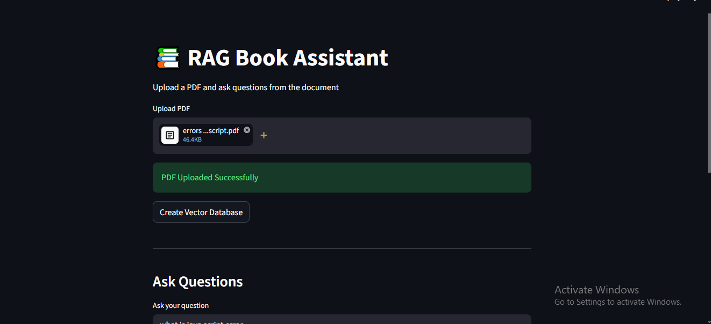
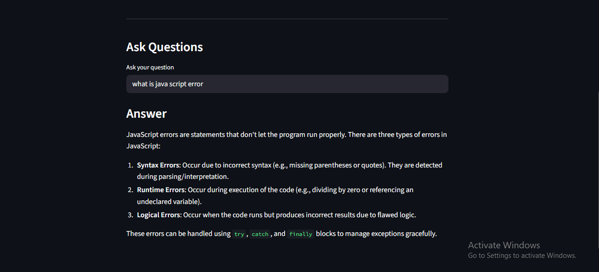

# 📚 DocuMind AI

A professional Retrieval-Augmented Generation (RAG) application built using Streamlit, LangChain, ChromaDB, HuggingFace Embeddings, and Mistral AI.

DocuMind AI allows users to upload PDF documents and ask AI-powered questions based on the document content using semantic search and vector retrieval.

---

# 🚀 Features

- 📄 Upload PDF documents
- ✂️ Automatic text chunking
- 🧠 HuggingFace embedding generation
- 🗂️ ChromaDB vector database
- 🤖 AI-powered question answering
- 🔍 Semantic similarity search
- ⚡ Fast and lightweight RAG pipeline
- 🎨 Interactive Streamlit interface

---

# 🛠️ Tech Stack

| Technology | Usage |
|---|---|
| Python | Backend Language |
| Streamlit | Frontend UI |
| LangChain | RAG Framework |
| ChromaDB | Vector Database |
| HuggingFace | Embeddings |
| Sentence Transformers | Embedding Models |
| Mistral AI | Large Language Model |
| PyPDF | PDF Parsing |

---

# 📂 Project Structure

```bash
RAG Project/
│
├── app.py
├── README.md
├── requirements.txt
├── chroma_db/
├── data/
└── .venv/
```

---

# ⚙️ Installation Guide

## 1️⃣ Clone Repository

```bash
git clone <your-repository-url>
cd "RAG Project"
```

---

## 2️⃣ Create UV Virtual Environment

```bash
uv venv
```

---

## 3️⃣ Activate Virtual Environment

### Windows

```powershell
.venv\Scripts\Activate
```

### Mac/Linux

```bash
source .venv/bin/activate
```

---

## 4️⃣ Install Dependencies

```bash
uv pip install streamlit langchain langchain-community langchain-text-splitters langchain-huggingface langchain-mistralai sentence-transformers==2.7.0 transformers==4.41.2 huggingface-hub==0.23.5 chromadb pypdf torch protobuf==3.20.3
```

---

# 🔑 Environment Variables

Create a `.env` file in the root directory.

```env
MISTRAL_API_KEY=your_api_key_here
```

---

# ▶️ Run Application

```bash
streamlit run app.py
```

Application will run at:

```bash
http://localhost:8501
```

---

# 🧠 How It Works

## Step 1 — Upload PDF

User uploads a PDF document using the Streamlit interface.

## Step 2 — Extract Text

PyPDF extracts text from uploaded PDFs.

## Step 3 — Split Into Chunks

LangChain text splitter divides the document into smaller chunks.

## Step 4 — Generate Embeddings

HuggingFace embedding model converts text chunks into vector embeddings.

## Step 5 — Store Vectors

Embeddings are stored inside ChromaDB vector database.

## Step 6 — Ask Questions

User enters questions related to uploaded documents.

## Step 7 — Retrieve Relevant Chunks

Semantic search retrieves the most relevant document chunks.

## Step 8 — Generate Final Answer

Mistral AI generates contextual answers using retrieved information.

---

# 📦 Main Dependencies

```txt
streamlit
langchain
langchain-community
langchain-text-splitters
langchain-huggingface
langchain-mistralai
sentence-transformers==2.7.0
transformers==4.41.2
huggingface-hub==0.23.5
chromadb
pypdf
torch
protobuf==3.20.3
```

---

# 📸 Screenshots

## Home Page



## Chat Interface



---

# 🔮 Future Improvements

- ✅ Chat history support
- ✅ Multiple PDF uploads
- ✅ Persistent vector database
- ✅ Authentication system
- ✅ Cloud deployment
- ✅ Docker support
- ✅ Conversation memory
- ✅ Better UI/UX

---

# 🧪 Example Questions

- "Summarize this PDF"
- "What are the key points?"
- "Explain chapter 2"
- "Who is the author?"
- "Give important definitions"

---

# ☁️ Deployment

## Streamlit Cloud

```bash
streamlit run app.py
```

---

## Render Deployment

Install dependencies:

```bash
uv pip install -r requirements.txt
```

Start command:

```bash
streamlit run app.py --server.port 10000 --server.address 0.0.0.0
```

---

# 👨‍💻 Author

Lucky Mishra

---

# 📄 License

This project is licensed under the MIT License.

---

# ⭐ Support

If you like this project, give it a ⭐ on GitHub.
